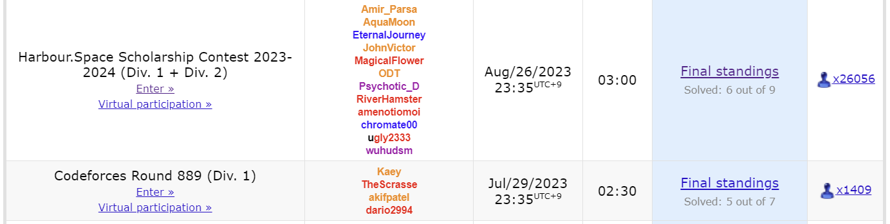
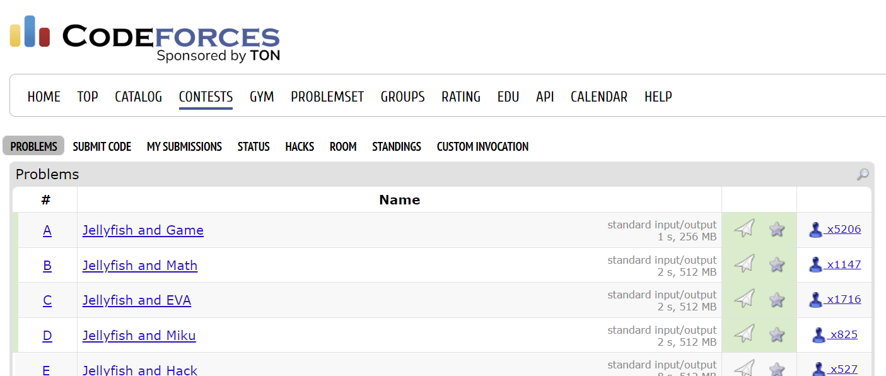

# Codeforces Multi-Handle Problem Highlighter

A Tampermonkey userscript that highlights solved problems and contest
submissions across **multiple Codeforces handles** --- directly on
Codeforces pages.

This script combines several Codeforces accounts and visually shows:

-   🟦 **Blue overlay** for problems solved by *any* of the selected
    handles
-   🟢 **Green check mark** for contest problems accepted by *any*
    handle
-   Fully customizable handle list

Perfect for alt accounts, friends, or team practice tracking.

------------------------------------------------------------------------

## ✨ Features

### 🔵 Multi-handle solved problem highlighting

Any problem solved by at least one handle will show a blue overlay.



as the blue highlight overlay.

------------------------------------------------------------------------

### 🟢 Contest AC indicator

On contest pages, problems with AC by any handle receive a green check
mark icon.



and places it next to the problem.

------------------------------------------------------------------------


## 🛠️ Installation Guide

1.  Install **Tampermonkey**\
    ➤ https://www.tampermonkey.net/

2.  Create a **New Userscript**

3.  Paste the script and edit the handle list:

``` js
// const handles = ["yourHandle1", "yourHandle2", "yourHandle3"];
```

## ⭐ Support

If you like this project, please **leave a star**!\
Pull requests are welcome --- feel free to improve detection, add
styles, or support more Codeforces pages.
